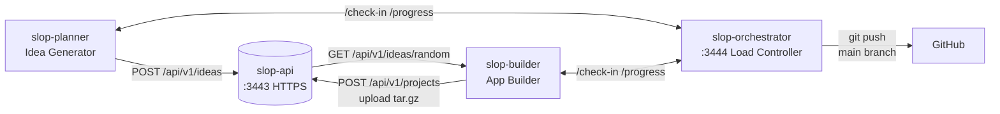

# Slop Generator

**Autonomous AI agents that generate ideas, plan apps, and build production software — on autopilot.**

[](#)
[](#)
[](#)
[](#)

Slop Generator is a monorepo of four containerized services that use [Cline CLI](https://github.com/cline/cline) with a local [LM Studio](https://lmstudio.ai/) backend to continuously generate unique app ideas, store them via a REST API, and build them into production applications. An orchestrator coordinates access to the single LM Studio instance so planner and builder never overlap.

---

## Architecture



| Service | Role | Port | Key Tech |
|---------|------|------|----------|
| **slop-planner** | Generates unique app concepts, pushes to API | — | Cline CLI + LM Studio |
| **slop-api** | REST API — stores and serves ideas as JSON | 3443 (HTTPS) | Express, JWT, self-signed TLS |
| **slop-builder** | Fetches random ideas, builds production apps | — | Cline CLI + LM Studio |
| **slop-orchestrator** | Turn-based load controller — prevents LLM overlap | 3444 (HTTP) | Express, in-memory + JSON state |

All four services run on a Docker bridge network (`slop-net`). Each owns its own data — no shared volumes.

→ **[Full architecture docs](./docs/ARCHITECTURE.md)** with data-flow diagrams, API specs, and resilience patterns.

---

## Quick Start

### Prerequisites

- [Docker](https://docker.com) + [Docker Compose](https://docs.docker.com/compose/)
- [LM Studio](https://lmstudio.ai/) running locally with a loaded model (e.g., `qwen/qwen3.5-9b`)

### Run All Services

```bash
# Clone and set your API key
git clone https://github.com/jtmb/slop-generator.git
cd slop-generator
echo "API_KEY=your-secret-key" > .env

# Start the full stack (4 containers)
docker compose up -d --build

# Watch logs
docker compose logs -f

# Check health
curl -k https://localhost:3443/health
curl http://localhost:3444/health
```

> [!TIP]
> The planner starts generating ideas immediately. The builder waits for ideas to accumulate, then builds them in batches. Use `docker compose ps` to see service status.

---

## How It Works

### Planner — 3-Phase Idea Loop

```
check-in → generate idea → post to API → report progress → repeat
```

The planner runs an autonomous agent loop with full crash recovery. Each iteration:

1. **Check-in** with orchestrator for turn permission
2. **Generate** a unique app concept via Cline CLI (reads `AGENTS.md` + `db.md`)
3. **Post to API** — upload idea to slop-api via POST /api/v1/ideas
4. **Report progress** — triggers turn flip after `BATCH_SIZE` iterations

State checkpoints at every phase boundary — resumes mid-iteration on restart.

### Builder — 6-Phase Build Pipeline

```
check-in → fetch idea → deep plan → build → test → upload → repeat
```

1. **Fetch** random idea from slop-api (deduplicates via own `db.md`)
2. **Deep Planning** — Cline researches best framework, writes `plan.md`
3. **Build** — JS agent-runner parses plan.md checkboxes, calls Cline for one task at a time
4. **Test** — runs test command, retries up to 3 times
5. **Upload** — creates tar.gz, POSTs to `/api/v1/projects` on slop-api
6. **Database** — marks complete or failed in builder's `db.md`

### Orchestrator — Turn-Based Coordinator

Planner and builder share one LM Studio instance — running both simultaneously degrades quality. The orchestrator enforces alternating batch execution:

```
planner → 6 ideas → flip → builder → 6 builds → flip → planner → ...
```

Workers poll `/check-in` before each iteration. When blocked, they sleep and retry with exponential backoff (5s→30s, max 10 retries). State persists to `/tmp/orchestrator-state.json` so turn position survives orchestator restarts.

→ **[Container interactions](./docs/CONTAINER-INTERACTIONS.md)** — full lifecycle diagrams, failure modes, recovery flows.

---

## Configuration

### Root `.env`

| Variable | Default | Purpose |
|----------|---------|---------|
| `API_KEY` | — | Shared secret for JWT token exchange |
| `CLINE_API_BASE_URL` | `http://192.168.0.13:1234/v1` | LM Studio endpoint |
| `CLINE_MODEL` | `qwen/qwen3.5-9b` | Model identifier |
| `GIT_REPO_URL` | — | Remote for git pushes (orchestrator → `main` branch only) |
| `GITHUB_TOKEN` | — | GitHub PAT for push auth (embedded as `x-access-token` in remote URL) |
| `BATCH_SIZE` | 6 | Iterations before turn flip |
| `ORCHESTRATOR_URL` | `http://slop-orchestrator:3444` | Coordination endpoint |

Per-service config lives in `slop-{service}/config/.env`. See [TECH-STACK.md](./docs/TECH-STACK.md) for the full dependency graph and runtime details.

---

## Project Structure

```
slop-generator/
├── slop-planner/           # Idea generator agent
│   ├── AGENTS.md           # Agent instructions — role, workflow, rules
│   ├── Dockerfile          # Multi-stage: cline-cli + node:22-slim
│   ├── db.md               # Planner's idea registry
│   ├── apps/               # Generated idea .md files
│   ├── scripts/            # agent-runner.js
│   └── config/             # .env, settings.json
│
├── slop-api/               # REST API microservice
│   ├── Dockerfile          # Express + JWT + self-signed TLS
│   ├── data/db.md          # API-owned idea database
│   ├── data/apps/          # Received idea .md files
│   ├── scripts/            # api-server.js
│   └── config/             # API env vars
│
├── slop-builder/           # App builder agent
│   ├── AGENTS.md           # Builder instructions
│   ├── Dockerfile          # Multi-stage: cline-cli + node:22-slim
│   ├── db.md               # Builder's project registry
│   ├── projects/           # Built applications (per slug)
│   ├── scripts/            # agent-runner.js (JS task mgmt, upload)
│   └── config/             # .env, settings.json
│
├── slop-orchestrator/      # Load controller
│   ├── Dockerfile          # Express 4.21 + Pino 9.5
│   ├── scripts/            # orchestrator.js
│   └── config/             # ORCHESTRATOR_PORT, BATCH_SIZE
│
├── tests/                  # Vitest test suites
│   ├── slop-planner/       # 34 tests — 4 files
│   ├── slop-api/           # 42 tests — 3 files
│   ├── slop-builder/       # 42 tests — 5 files
│   └── slop-orchestrator/  # 17 tests — 1 file
│
├── docs/                   # Documentation (10 files, all with Mermaid diagrams)
├── docker-compose.yml      # Root compose — 4 services + slop-net
├── .env                    # Root env vars
└── AGENTS.md               # Monorepo conventions
```

---

## Testing

135 tests across 13 files, all Vitest v3. Run from any service directory:

```bash
cd tests/slop-planner && npx vitest run       # 34 tests
cd tests/slop-api && npx vitest run            # 42 tests
cd tests/slop-builder && npx vitest run        # 42 tests
cd tests/slop-orchestrator && npx vitest run   # 17 tests
```

→ **[TESTING.md](./docs/TESTING.md)** — test structure, patterns, mocking conventions.

---

## Documentation

| Document | Covers |
|----------|--------|
| [ARCHITECTURE.md](./docs/ARCHITECTURE.md) | Service topology, data flow, API endpoints, design decisions |
| [CONTAINER-INTERACTIONS.md](./docs/CONTAINER-INTERACTIONS.md) | Planner/builder lifecycles, failure modes, recovery, reconciliation |
| [TECH-STACK.md](./docs/TECH-STACK.md) | Dependency graph, package summaries, per-service stack details |
| [API.md](./docs/API.md) | slop-api endpoints, auth flow, request/response shapes |
| [API_USAGE.md](./docs/API_USAGE.md) | Client integration examples, JWT usage, error handling |
| [SLOP-PLANNER.md](./docs/SLOP-PLANNER.md) | Planner agent loop, phases, configuration |
| [SLOP-BUILDER.md](./docs/SLOP-BUILDER.md) | Builder pipeline, phases, reconciliation |
| [SLOP-ORCHESTRATOR.md](./docs/SLOP-ORCHESTRATOR.md) | Turn-based coordination, state machine, state persistence |
| [GIT_OPS.md](./docs/GIT_OPS.md) | Orchestrator-owned single-branch git, push flow, `.gitignore` patterns |
| [TESTING.md](./docs/TESTING.md) | Test structure, patterns, mocking conventions |

All docs include Mermaid diagrams for architecture, data flow, lifecycles, and state machines.

---

## Design Principles

- **No shared volumes** — Each service owns its data independently
- **API as single source of truth** — Planner pushes to API, builder reads from API
- **Only API carries heavy packages** — Express/JWT isolated to slop-api and orchestrator
- **Orchestrator-owned git** — orchestrator pushes all artifacts to a single `main` branch
- **Crash recovery everywhere** — JSON state files, phase checkpoints, directory reconciliation
- **Turn-based coordination** — One LLM consumer at a time, enforced by orchestrator
