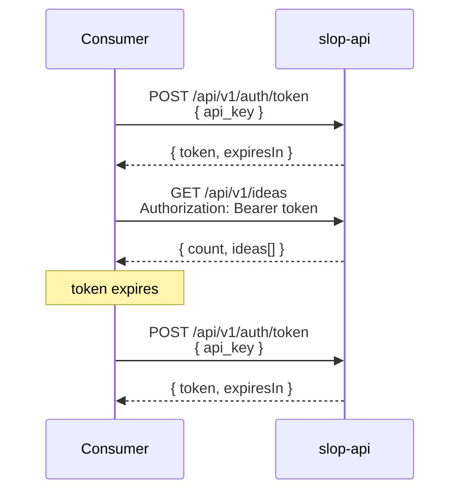
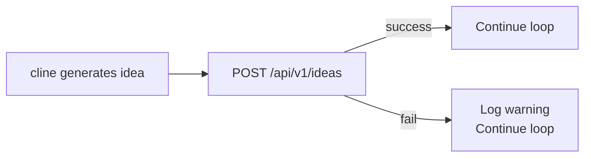

# API Usage Guide

> Reference documentation: [API.md](API.md). Architectural overview: [ARCHITECTURE.md](ARCHITECTURE.md).

Practical usage patterns for the slop-api microservice. Covers authentication lifecycle, producer (planner) and consumer (builder) integration, error recovery, and debugging TLS in Docker.

---

## Quick Setup

The API needs one shared secret across all containers:

```bash
# In repo root .env (read by docker compose)
API_KEY=your-shared-secret-here
```

All services get this via `docker-compose.yml` `environment:` → `API_KEY=${API_KEY:-}`. The API uses it to validate token requests; planner and builder use it to authenticate; the orchestrator uses `ORCHESTRATOR_PORT` and `BATCH_SIZE`.

---

## Authentication Lifecycle



**Token caching** (as done in builder's `agent-runner.js`):

```js
let jwtToken = null;

async function authenticate() {
  if (jwtToken) return jwtToken;        // reuse until expired
  const { data } = await api.post('/api/v1/auth/token', { api_key: API_KEY });
  jwtToken = data.token;
  return jwtToken;
}
```

If a request returns 401, discard the cached token and re-authenticate.

---

## Producer Pattern — slop-planner

The planner pushes each generated idea after generating it.

**Flow per iteration:**



**POST shape (what planner sends):**

```json
{
  "name": "EcoTrack",
  "slug": "eco-track",
  "category": "Sustainability / Productivity",
  "overview": "EcoTrack is a comprehensive carbon footprint tracking application...",
  "problemSolved": "Many people want to live more sustainably but lack...",
  "targetAudience": ["Environmentally conscious individuals aged 18-45"],
  "keyFeatures": [
    { "title": "Activity Logging", "description": "Easy-to-use interface for logging..." }
  ],
  "monetization": ["Freemium Model: Free basic tracking..."],
  "techStack": {
    "frontend": "React Native",
    "backend": "Node.js with Express",
    "database": "PostgreSQL + Redis"
  },
  "implementationPlan": "See plan for details."
}
```

**Idempotency:** The API returns 409 if the slug already exists. Planner can safely retry pushes without creating duplicates.

**Docker networking:** Planner reaches the API at `https://slop-api:3443`. Self-signed cert accepted via `NODE_TLS_REJECT_UNAUTHORIZED=0`.

---

## Consumer Pattern — slop-builder

The builder fetches a random idea, deduplicates via its own `db.md`, then builds it.

**Fetch with dedup loop (from `agent-runner.js`):**

```js
let idea;
for (let attempt = 0; attempt < 10; attempt++) {
  idea = await fetchRandomIdea();           // GET /api/v1/ideas/random
  if (!isAlreadyBuilt(idea.slug)) break;    // check builder's own db.md
  console.log(`Already built ${idea.slug}. Fetching another...`);
  idea = null;
}
if (!idea) {
  // All 10 random picks were already built — wait for planner to generate more
  await sleep(60000);
  continue;
}
```

**Full idea response** includes `details.*` with parsed sections ready for the plan prompt:

```json
{
  "id": 1,
  "name": "EcoTrack",
  "slug": "eco-track",
  "category": "Sustainability / Productivity",
  "details": {
    "overview": "...",
    "problemSolved": "...",
    "targetAudience": ["..."],
    "keyFeatures": [{ "title": "...", "description": "..." }],
    "monetization": ["..."],
    "techStack": { "frontend": "...", "backend": "...", "database": "..." },
    "progress": {
      "idea_generated": true,
      "plan_created": false,
      "development_started": false,
      "mvp_complete": false,
      "launched": false
    }
  }
}
```

The `details` object is injected directly into the builder's deep-planning prompt as JSON for the AI to parse.

---

## Direct API Access (curl)

All examples assume `API_KEY=slop-test-key-2026` in root `.env`.

```bash
# 1. Get a token
TOKEN=$(curl -sk https://localhost:3443/api/v1/auth/token \
  -H "Content-Type: application/json" \
  -d '{"api_key":"slop-test-key-2026"}' | jq -r '.token')

# 2. List all ideas (metadata only)
curl -sk https://localhost:3443/api/v1/ideas \
  -H "Authorization: Bearer $TOKEN" | jq .

# 3. Get random full idea
curl -sk https://localhost:3443/api/v1/ideas/random \
  -H "Authorization: Bearer $TOKEN" | jq .

# 4. Get specific idea by slug
curl -sk https://localhost:3443/api/v1/ideas/eco-track \
  -H "Authorization: Bearer $TOKEN" | jq .

# 5. Push a new idea
curl -sk https://localhost:3443/api/v1/ideas \
  -H "Authorization: Bearer $TOKEN" \
  -H "Content-Type: application/json" \
  -d '{
    "name": "TestApp",
    "slug": "test-app",
    "category": "Developer Tools",
    "overview": "A test app for API validation.",
    "problemSolved": "Testing the ingestion pipeline.",
    "targetAudience": ["QA Engineers"],
    "keyFeatures": [{"title": "Test Runner", "description": "Runs integration tests"}],
    "monetization": [],
    "techStack": {"frontend": "React", "backend": "Node.js", "database": "SQLite"}
  }' | jq .
```

---

## TLS & Docker Networking

The API uses self-signed certificates generated at container startup via openssl:

```
Certificate subject: /CN=slop-api/O=Slop Generator/C=US
Stored at:           /tmp/api-certs/ (ephemeral, regenerated each restart)
```

**Inside Docker (service-to-service):**

| Caller | Target | TLS |
|--------|--------|-----|
| slop-planner → slop-api | `https://slop-api:3443` | `NODE_TLS_REJECT_UNAUTHORIZED=0` |
| slop-builder → slop-api | `https://slop-api:3443` | `NODE_TLS_REJECT_UNAUTHORIZED=0` |

**Outside Docker (host → container):**

```bash
curl -k https://localhost:3443/health   # -k skips cert validation
```

**Why self-signed?** The API is internal-only on the Docker bridge network. No need for a real CA — the bridge isolates traffic. `NODE_TLS_REJECT_UNAUTHORIZED=0` is safe because only the three known containers share the network.

---

## Error Recovery

### Token expiration (401)

```js
// On any 401, discard cached token and re-authenticate
if (error.response?.status === 401) {
  jwtToken = null;
  return retry();
}
```

### Duplicate slug (409)

```js
// Idempotent POST — safe to ignore or log
if (error.response?.status === 409) {
  console.log(`Idea ${slug} already exists in API — skipping.`);
  return; // Not an error
}
```

### Connection refused

Happens when the API container hasn't finished starting. Builder's `docker-compose.yml` uses `depends_on: slop-api: service_healthy` to prevent this, but if it still occurs:

```js
if (error.code === 'ECONNREFUSED') {
  console.error('API unreachable. Retrying next iteration.');
  await sleep(10000);
}
```

### API unreachable (fatal)

If the API stays down across multiple iterations (timeout, DNS failure), the builder exits:

```js
if (error.message.includes('ETIMEDOUT') || error.message.includes('ECONNREFUSED')) {
  console.error('Fatal: cannot reach slop-api. Stopping.');
  process.exit(1);
}
```

The planner treats API push failures as non-fatal — the idea is still in the local `db.md` and will be retried on the next iteration.

---

## Health Check

```bash
curl -k https://localhost:3443/health
# {"status":"ok","timestamp":"2026-06-27T18:00:00.000Z"}
```

Docker health check uses the same endpoint internally:

```yaml
healthcheck:
  test: ["CMD", "node", "-e", "require('https').request({host:'localhost',port:3443,path:'/health',rejectUnauthorized:false},r=>{process.exit(r.statusCode===200?0:1)}).end()"]
  interval: 30s
  timeout: 5s
  retries: 3
```
