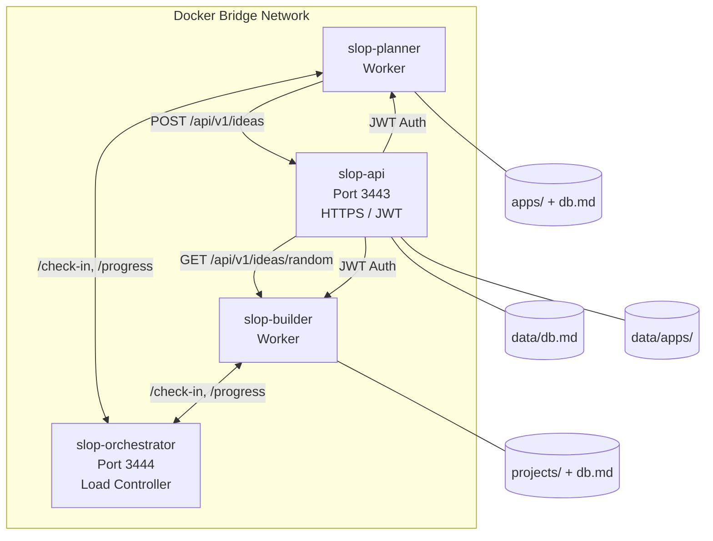
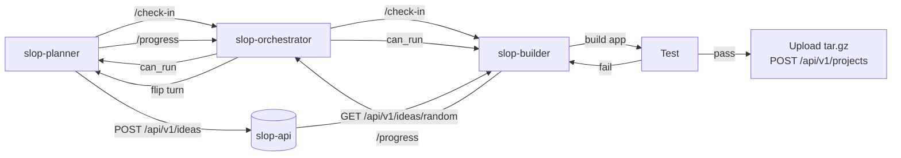
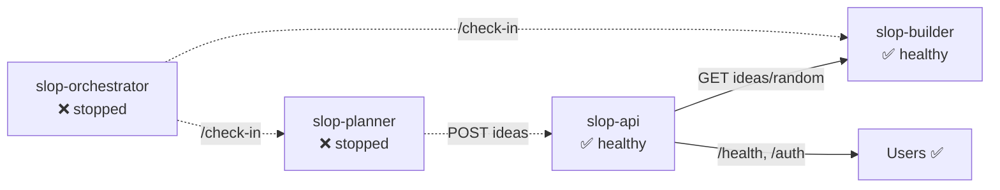

# Architecture

> See [README.md](../README.md) for the full project overview and quick start guide.

## Four-Service Microservice Architecture



**Each service owns its own data.** No shared data volumes between containers.

**State persistence**: Agent state files (`.agent-state.json`, `.posted-slugs.json`, `orchestrator-state.json`) are bind-mounted from the host to survive `docker compose down/up`. See [CONTAINER-INTERACTIONS.md](CONTAINER-INTERACTIONS.md#state-file-locations) for details.

## Service Details

### slop-orchestrator — Load Controller
- **Role**: Coordinates turn-based batch execution between planner and builder
- **Tech**: Express 4.21, Pino 9.5, Node.js 22
- **Internal-only**: No host port exposure — HTTP on 3444 within slop-net
- **State**: In-memory with JSON file persistence (`/tmp/orchestrator-state.json`) — survives container restarts
- **Endpoints**: /health, /state, /check-in, /progress

### slop-planner — App Idea Generator (Worker)
- **Role**: Autonomous agent that generates unique app concepts
- **Tech**: Cline CLI + LM Studio, Node.js 22
- **Data**: `apps/`, `db.md` (bind-mounted, independent)
- **Output**: Pushes generated ideas to slop-api via POST /api/v1/ideas
- **Ports**: None (worker, not a server)
- **Heavy packages**: None — only axios + dotenv

### slop-api — REST API Microservice
- **Role**: Serves and accepts app ideas as structured JSON
- **Tech**: Express 4.21, JWT (HS256), self-signed TLS via openssl
- **Data**: `data/db.md`, `data/apps/` — API-owned, not planner's
- **Auth**: Pre-shared API_KEY exchanges for JWT bearer tokens
- **Ports**: 3443 (HTTPS)
- **Heavy packages**: express, jsonwebtoken (exclusively in this service)

### slop-builder — App Builder
- **Role**: Consumes random ideas, builds full production apps
- **Tech**: Cline CLI + LM Studio, Node.js 22
- **Data**: `projects/`, `db.md` (bind-mounted, independent)
- **Workflow**: Fetch → Deep Plan → Build (JS task loop) → Test → Upload
- **Ports**: None (worker, not a server)
- **Heavy packages**: None — only axios + dotenv

## Data Flow



## API Endpoints (slop-api)

| Method | Path | Auth | Description |
|--------|------|------|-------------|
| GET | /health | none | Health check |
| POST | /api/v1/auth/token | api_key | Obtain JWT |
| GET | /api/v1/ideas | JWT | List all ideas |
| GET | /api/v1/ideas/random | JWT | Random idea |
| GET | /api/v1/ideas/:slug | JWT | Single idea |
| POST | /api/v1/ideas | JWT | Ingest new idea |

## Builder Workflow (slop-builder)

Each iteration follows six phases:

1. **Fetch** — GET /api/v1/ideas/random (deduplicate via own db.md)
2. **Deep Planning** — cline researches best framework, writes plan.md with phases
3. **Build** — cline executes one phase at a time from plan.md, checks off items
4. **Test** — runs test command from plan.md, retries up to 3 times
5. **Upload** — creates tar.gz, POSTs to `/api/v1/projects` on slop-api
6. **Database** — updates builder's own db.md with completion status

## Orchestrator Coordination

The orchestrator prevents slop-planner and slop-builder from running simultaneously
(they share one LM Studio instance). Workers poll /check-in before each iteration and
report /progress after. When BATCH_SIZE iterations complete, the turn flips.

### Planner Integration
```
┌── /check-in ──▶ wait 30s (if blocked) ◀── loop
│
├── generate idea
├── post to API
│
└── /progress ──▶ batch_complete? ──▶ yield
```

### Builder Integration (identical pattern, role: "builder")

See [SLOP-ORCHESTRATOR.md](./SLOP-ORCHESTRATOR.md) for full API specs and state machine.

## Resiliency

See [CONTAINER-INTERACTIONS.md](./CONTAINER-INTERACTIONS.md) for detailed self-healing flows,
recovery sequences, failure modes, and project directory reconciliation.



Neither slop-api nor slop-builder depends on slop-planner at runtime. The planner is purely an idea producer — once ideas are in the database, the builder reads them through the API without any planner involvement. If the orchestrator is unreachable, workers retry with exponential backoff (5s-30s) up to 10 times before throwing an error — preventing uncoordinated LLM usage.

## Key Design Decisions

- **spawnSync over execSync**: Avoids shell quoting issues with multi-line prompts
- **File-based plan handoff**: Each phase writes its output, next phase reads it
- **Independent data per service**: No shared volumes — each service owns its data
- **Only slop-api carries heavy packages**: express/jsonwebtoken isolated to API
- **Orchestrator-owned git**: orchestrator pushes all artifacts to a single `main` branch
- **Dead code cleanup**: Every refactor removes orphaned files — see `.github/instructions/cleanup-dead-code.instructions.md`
