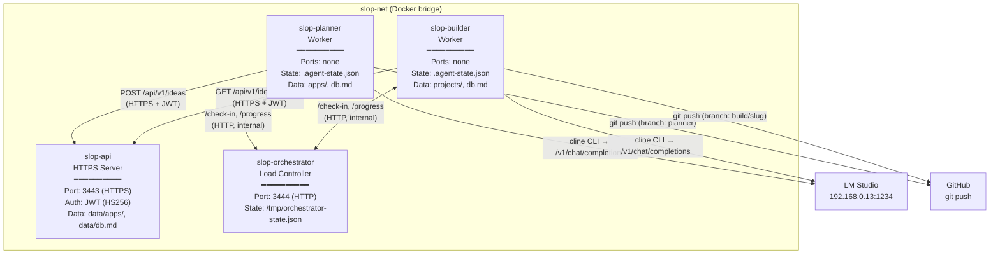
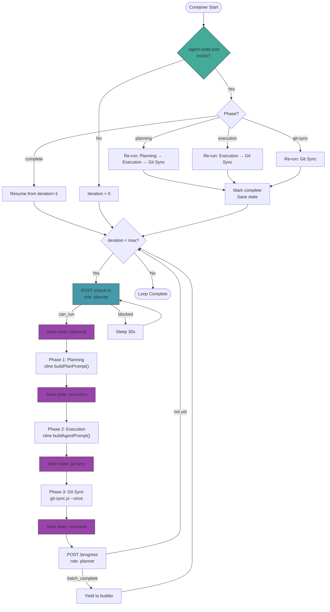
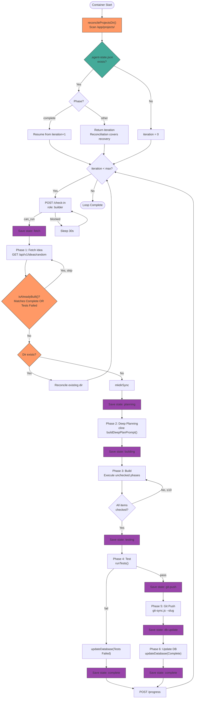
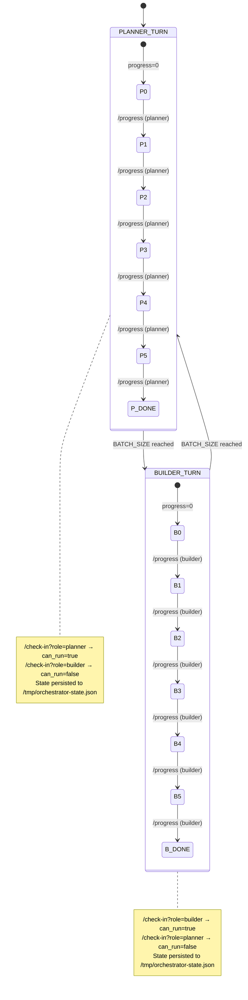
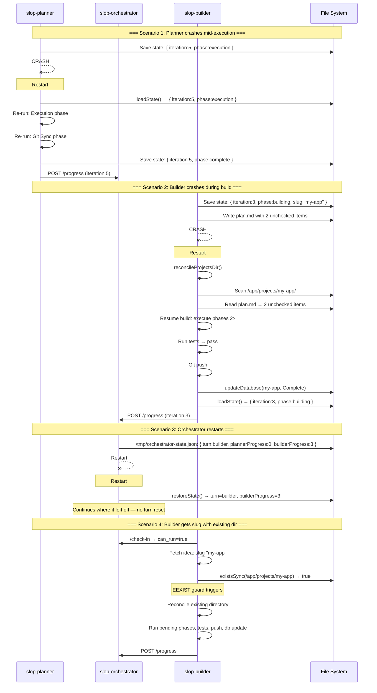
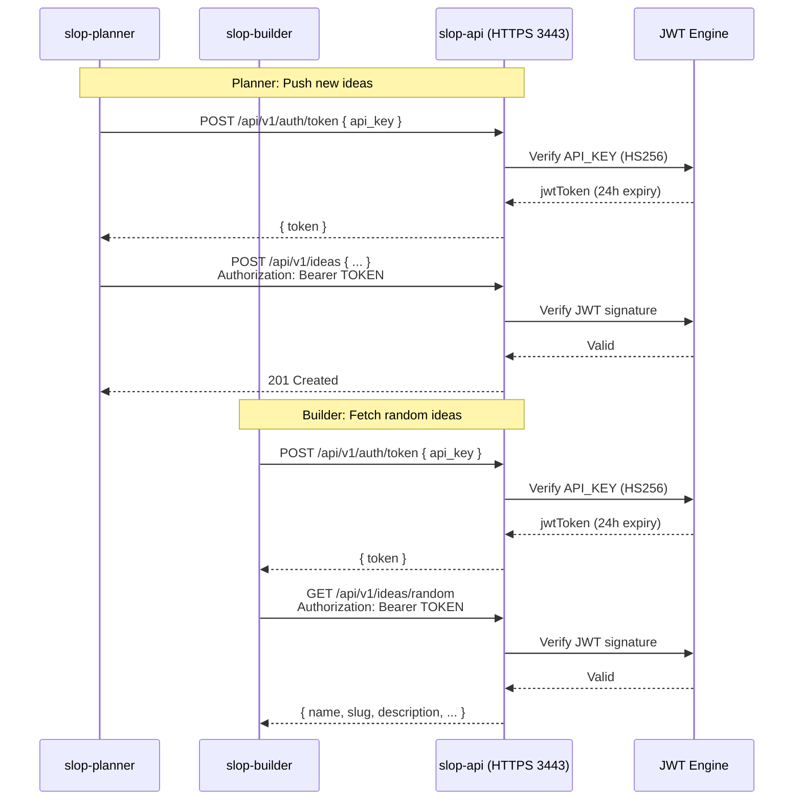

# Container Interactions

> High-level overview of how the four containers communicate, coordinate, and recover from failures.

## Service Topology

**Key**: Solid arrows = HTTP requests. Dotted = coordination. No shared volumes. Each service owns its data.

---

## Planner Lifecycle

The planner runs a 3-phase autopilot loop with state checkpoints at every boundary:

**State save points** (blue nodes): Atomic write-then-rename to `.agent-state.json`. On crash, the next startup reads the last saved phase and resumes from there.

---

## Builder Lifecycle

The builder runs a 6-phase pipeline with full project directory reconciliation on startup:

**Reconciliation** (orange nodes): On startup, scans `/app/projects/` for interrupted builds. See [Project Reconciliation](#project-directory-reconciliation) below.

---

## Orchestrator State Machine

**Persistence**: Every `/progress` call writes to `/tmp/orchestrator-state.json` (atomic tmp+rename). On restart, `restoreState()` reads it — survives orchestrator crashes.

---

## Self-Healing Sequence

What happens when containers crash and restart:

---

## Auth Flow

**Key points**:
- `API_KEY` is a pre-shared secret in each worker's `.env` file
- JWT tokens are cached in memory per worker process — exchanged once on startup
- All API traffic uses HTTPS (self-signed cert, internal Docker network)
- No auth on orchestrator — internal-only, no host port exposure

---

## Failure Modes

```mermaid
graph TB
    subgraph Errors["Failure Modes & Recovery"]
        E1["LM Studio unreachable<br/>(ECONNREFUSED/ETIMEDOUT)"]
        E2["Orchestrator unreachable"]
        E3["Duplicate slug fetched<br/>(dir already exists)"]
        E4["Tests fail<br/>(all retries exhausted)"]
        E5["Git push fails<br/>(network/auth)"]
        E6["Mid-phase crash<br/>(container restart)"]
        E7["Orchestrator crash<br/>(state loss)"]
    end

    E1 --> R1["Agent exits with code 1<br/>Docker restart: unless-stopped"]
    E2 --> R2["Fail-open: proceed without<br/>coordination. Both workers run."]
    E3 --> R3["Reconcile existing dir<br/>Resume build or skip if done."]
    E4 --> R4["updateDatabase(Tests Failed)<br/>isAlreadyBuilt matches → won't re-fetch."]
    E5 --> R5["updateDatabase(Built push failed)<br/>Non-fatal — continue loop."]
    E6 --> R6["Startup recovery:<br/>Read .agent-state.json<br/>Re-run interrupted phase(s)."]
    E7 --> R7["restoreState() from<br/>/tmp/orchestrator-state.json<br/>Turn + progress preserved."]

    style E1 fill:#e44,stroke:#333
    style E2 fill:#e94,stroke:#333
    style E3 fill:#e94,stroke:#333
    style E4 fill:#e94,stroke:#333
    style E5 fill:#e94,stroke:#333
    style E6 fill:#4a9,stroke:#333
    style E7 fill:#4a9,stroke:#333
    style R1 fill:#fdd,stroke:#333
    style R2 fill:#ffd,stroke:#333
    style R3 fill:#ffd,stroke:#333
    style R4 fill:#ffd,stroke:#333
    style R5 fill:#ffd,stroke:#333
    style R6 fill:#dfd,stroke:#333
    style R7 fill:#dfd,stroke:#333
```

---

## Project Directory Reconciliation

On every startup, `slop-builder` scans `/app/projects/` and handles each directory:

| State | Action |
|-------|--------|
| Dir with no `plan.md` | **Delete** — orphan leftover from crash before planning |
| `plan.md` has unchecked `- [ ]` items | **Resume build** — execute remaining phases (up to 10 iterations) |
| `plan.md` fully checked, no db entry | **Run tests** → **Git push** → **updateDatabase** |
| Dir with db entry already | **Skip** — already tracked |

This guarantees no project is left in a half-built state across restarts.

---

## State File Locations

| Container | File | Content |
|-----------|------|---------|
| slop-planner | `/app/.agent-state.json` | `{ iteration, phase (planning\|execution\|git-sync\|complete), currentSlug, lastUpdated }` |
| slop-builder | `/app/.agent-state.json` | `{ iteration, phase (fetch\|planning\|building\|testing\|git-push\|db-update\|complete), currentSlug, lastUpdated }` |
| slop-orchestrator | `/tmp/orchestrator-state.json` | `{ turn, plannerProgress, builderProgress, lastUpdated }` |

All files use atomic write (tmp + rename) to prevent corruption on crash mid-write.
