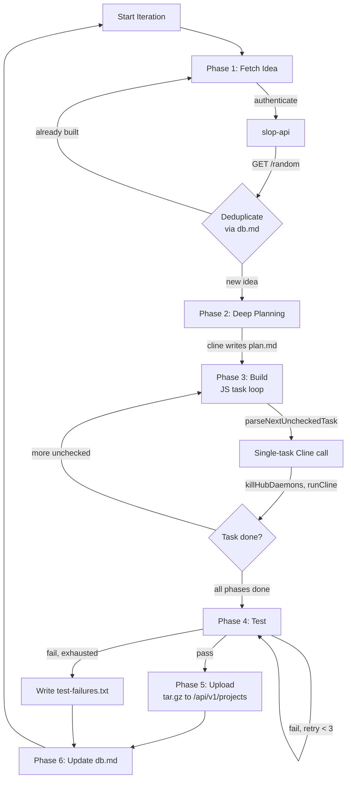

# Slop Builder — App Builder Agent

## Overview

The Slop Builder is an autonomous agent that consumes random app ideas from slop-api and builds full production applications. It uses Cline CLI with LM Studio as the AI backend, with a **JavaScript-side task manager** that orchestrates Cline calls one task at a time. Completed projects are uploaded to slop-api as tar.gz archives — git operations are handled by the orchestrator.

---

## Agent Loop (scripts/agent-runner.js)



Each iteration has six phases:

### Phase 1: Fetch Idea
- Authenticates with slop-api (JWT via API_KEY)
- GETs `/api/v1/ideas/random`
- **JWT re-auth on expiry**: `fetchRandomIdea()` catches 401/403 responses, clears the cached `jwtToken`, re-authenticates, and retries once.
- Checks own `db.md` for duplicates — skips already-built projects
- Retries up to 10 times if all fetched ideas are duplicates

### Phase 2: Deep Planning
- Calls `runCline(prompt)` with a planning prompt that includes inline context
- Cline researches and selects the best framework stack for the idea
- Cline creates `/app/projects/{slug}/plan.md` with all phases and checkboxes
- Plan includes: Framework Decision, project structure, and phased checklists

### Phase 3: Build (JS Task Loop)
The agent-runner manages build progress in JavaScript, not inside Cline:

1. **`parseNextUncheckedTask(planPath)`** — reads `plan.md`, finds the first `- [ ]` item, returns the task text and its phase heading
2. **`buildSimpleTaskPrompt(slug, projectDir, planPath, taskInfo)`** — builds a single-task prompt with inline context (~15 lines of plan context, framework choice, file type hints)
3. **`runCline(prompt)`** — calls `killHubDaemons()` then `spawnSync('cline', args)` with 960s timeout
4. **`markTaskDone(planPath, lineNumber)`** — changes `- [ ]` to `- [x]` in plan.md

**Build limits**: `maxBuildCalls = 25` (main loop), `maxReconcileBuildCalls = 20` (recovery loop).

### Phase 4: Test
- Extracts test command from plan.md (looks for `## Test Command` section)
- Runs tests via `spawnSync`, retries up to 3 times on failure
- If all retries fail, writes `test-failures.txt` and moves to next iteration

### Phase 5: Upload
- `uploadProject(slug)` creates a tar.gz of the project directory
- POSTs it as multipart form data to `/api/v1/projects` on slop-api
- The orchestrator later downloads and pushes projects to git at batch boundaries
- **Cline does NOT perform git operations**

### Phase 6: Database Update
- Updates builder's own `db.md` with project entry and status
- Statuses: "Complete", "Tests Failed"

---

## Cline Interaction Patterns

### Cline CLI Version Compatibility — CRITICAL

| Version | `run_commands` status | Notes |
|---------|----------------------|-------|
| **v3.0.29** ✅ | Working | Full shell: `mkdir -p`, `ls`, `cat > file << 'EOF'`, `npm install`, heredocs — all functional |
| **v3.0.31** ❌ | Broken | `posix_spawn` ENOENT on every command — treats entire command string as binary name |

**Pinned at v3.0.29** in Dockerfile (`npm install -g cline@3.0.29`). Do not bump without verifying `run_commands` still works.

### Actual Cline Tool Behavior (v3.0.29)

| Tool | Works? | Notes |
|------|--------|-------|
| `write_to_file` | ✅ | Creates files with parent dirs |
| `editor` | ⚠️ | Works but has 6000-char limit — model self-corrects by falling back to shell |
| `read_file` | ✅ | Reads files normally |
| `run_commands` | ✅ | Full bash available: `mkdir -p`, `ls`, `cat > file << 'EOF'`, heredocs, `npm install`, `npm test` |

### Prompt Design — Proven Patterns

**DO NOT add ENVIRONMENT hints** telling the model what tools work or don't work. The model discovers tool capabilities through normal trial-and-error. Adding defensive instructions like "run_commands does NOT work" creates worse behavior than letting the model figure it out.

**DO NOT handle npm/tests in JavaScript.** The model runs `npm install`, `npm test`, and shell commands naturally through `run_commands`. The JS runner should stay out of the build loop beyond task orchestration (parsing plan.md, spawning Cline, marking checkboxes).

**Keep prompts simple.** Inline JSON idea context + plan template. No tool micromanagement, no environment warnings, no "don't read files" instructions.

### Hub Daemon Cleanup

Before every Cline call, `killHubDaemons()` scans `/proc/*/cmdline` for `hub-daemon` processes and SIGKILLs them. Without this, stale daemons reject hooks from new Cline instances after ~4 calls, causing 5-minute timeouts.

### Single-Task Prompts

Send ONE simple task per Cline call. The JS agent-runner manages progress — Cline doesn't need to read files or track state:

```
Create the project scaffolding for {app}. Initialize a React app with Vite,
set up TypeScript strict mode, and create the directory structure.

Project directory: /app/projects/{slug}
The project uses React + Vite + TypeScript.

Write these files:
1. package.json with dependencies
2. tsconfig.json with strict mode
3. vite.config.ts
```

### Inline Context

All context is embedded directly in the prompt. Cline is NOT asked to read files (files >100 lines cause timeouts):

- Framework choice (e.g., "Next.js 14 + TypeScript + Prisma + SQLite")
- File type hints ("Create TypeScript files" / "Write JSX components")
- Project structure ("Files go in `/app/projects/{slug}/` with `src/` and `tests/` directories")
- ~15 lines of relevant plan context from the current phase

**Never include**: "Read AGENTS.md", "Read plan.md", "Read .clinerules/instructions/", or "Open the editor tool".

---

## Plan.md Format

Each project gets a plan.md in `/app/projects/{slug}/plan.md`:

```markdown
# Build Plan: {App Name}
- **Slug**: {slug}
- **Framework**: {framework + rationale}
- **Created**: {timestamp}

## Phase 1: Project Scaffolding
- [ ] Initialize project with {framework} CLI
- [ ] Set up TypeScript configuration
- [ ] Configure ESLint and Prettier

## Phase 2: Data Layer
- [ ] Design database schema
- [ ] Set up ORM and initial migration
- [ ] Create seed data

## Phase 3: API Routes
- [ ] Set up API router structure
- [ ] Implement CRUD endpoints
- [ ] Add input validation and error handling

## Phase 4: Frontend
- [ ] Create layout and routing
- [ ] Implement feature pages per idea spec
- [ ] Wire up API calls from frontend

## Phase 5: Auth & Security
- [ ] Implement authentication flow
- [ ] Add protected routes and CORS

## Phase 6: Polish
- [ ] Add responsive design
- [ ] Write README with setup instructions
- [ ] Optimize production build

## Test Command
`npm test`
```

The `- [ ]` → `- [x]` checkbox format is critical — `parseNextUncheckedTask()` and `markTaskDone()` rely on it.

---

## Configuration

- **config/settings.json**: max_iterations (50), max_test_retries (3), timeout_ms (600000)
- **config/.env**: API_BASE_URL, API_KEY, CLINE_PROVIDER, CLINE_API_BASE_URL, CLINE_MODEL
- Environment variables override settings.json values
- **No GIT_REPO_URL** — builder doesn't push to git

---

## Container

- **Base Image**: node:22-slim → multi-stage build
- **Runtime Dependencies**: tini, git, ca-certificates, cline@3.0.29
- **User**: node (uid 1000, non-root)
- **Health Check**: `node -e "console.log('healthy')"`
- **Entrypoint**: tini → node scripts/agent-runner.js
- **Network**: Internal Docker bridge (slop-net), accepts self-signed API certs
