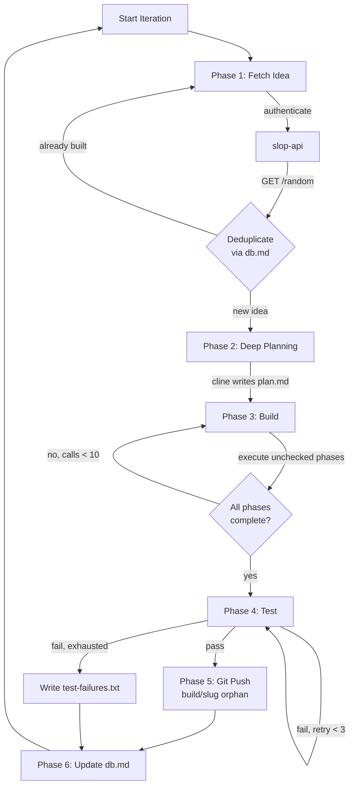

# Slop Builder — App Builder Agent

## Overview

The Slop Builder is an autonomous agent that consumes random app ideas from slop-api and builds full production applications. It uses Cline CLI with LM Studio as the AI backend, executing a multi-phase workflow that culminates in a tested, production-ready app pushed to a per-project git branch.

## Agent Loop (scripts/agent-runner.js)



Each iteration has six phases:

### Phase 1: Fetch Idea
- Authenticates with slop-api (JWT via API_KEY)
- GETs /api/v1/ideas/random
- Checks own db.md for duplicates — skips already-built projects
- Retries up to 10 times if all fetched ideas are duplicates

### Phase 2: Deep Planning
- Calls `cline -P lmstudio` with the planning prompt
- cline reads AGENTS.md (builder role instructions)
- cline researchs and selects the best framework stack for the idea
- cline reads applicable .clinerules/instructions/ files
- cline creates `/app/projects/{slug}/plan.md` with all phases
- Plan template includes: Framework Decision, Applicable .clinerules, and 7 build phases

### Phase 3: Build (Iterative)
- Loop: reads plan.md, executes the next unchecked phase
- Each cline call reads the plan, finds first `- [ ]` item, executes ALL items in that phase
- Updates plan.md as items complete: `- [ ]` → `- [x]`
- Stops when all items checked or max calls (10) reached

### Phase 4: Test
- Extracts test command from plan.md (looks for `## Test Command` section)
- Runs tests via spawnSync, retries up to 3 times on failure
- If all retries fail, writes `test-failures.txt` and skips git push

### Phase 5: Git Push
- Calls `scripts/git-sync.js --once --slug {slug} --message {...}`
- Creates orphan branch `build/{slug}` with no shared history between projects
- Pushes to remote if GIT_REPO_URL is configured

### Phase 6: Database Update
- Updates builder's own db.md with project entry and status
- Statuses: "Complete", "Tests Failed", "Built (push failed)"

## Plan.md Format

Each project gets a plan.md in `/app/projects/{slug}/plan.md`:

```markdown
# Build Plan: {App Name}
- **Slug**: {slug}
- **Framework**: {framework + rationale}
- **Created**: {timestamp}

## Applicable .clinerules
- containers.instructions.md
- api-design.instructions.md
- {framework}.instructions.md

## Phase 1: Project Scaffolding
- [ ] Initialize project with {framework} CLI
- [ ] Set up TypeScript configuration
- [ ] Configure ESLint and Prettier
- [ ] Set up Docker dev container

## Phase 2: Data Layer
- [ ] Design database schema
- [ ] Set up Prisma/Drizzle/Knex ORM
- [ ] Write initial migration
- [ ] Create seed data

## Phase 3: API Routes
- [ ] Set up API router structure
- [ ] Implement CRUD endpoints
- [ ] Add input validation (Zod)
- [ ] Add error handling middleware

## Phase 4: Frontend Shell
- [ ] Create layout components
- [ ] Implement routing (Next.js App Router / React Router)
- [ ] Set up global styles and theme
- [ ] Create shared UI components

## Phase 5: Feature Pages
- [ ] Implement feature pages per idea spec
- [ ] Wire up API calls from frontend
- [ ] Add loading and error states

## Phase 6: Auth & Security
- [ ] Implement authentication flow
- [ ] Add protected routes
- [ ] Set up CSRF protection
- [ ] Configure CORS

## Phase 7: Polish & Deploy
- [ ] Add responsive design
- [ ] Implement dark mode (if specified)
- [ ] Write README with setup instructions
- [ ] Optimize production build

## Test Command
`npm test`
```

## Configuration

- **config/settings.json**: max_iterations (50), max_test_retries (3), timeout_ms (600000)
- **config/.env**: API_BASE_URL, API_KEY, CLINE_PROVIDER, CLINE_API_BASE_URL, CLINE_MODEL, GIT_REPO_URL
- Environment variables override settings.json values

## Git Strategy

Each project gets its own orphan branch: `build/{slug}`. This means:
- No shared git history — each project is completely independent
- Branches can be force-pushed without affecting other projects
- Clean separation: one branch = one app

## Container

- **Base Image**: node:22-slim → multi-stage build
- **Runtime Dependencies**: tini, git, ca-certificates, cline@3.0.31
- **User**: node (uid 1000, non-root)
- **Health Check**: node -e "console.log('healthy')"
- **Entrypoint**: tini → node scripts/agent-runner.js
- **Network**: Internal Docker bridge (slop-net), accepts self-signed API certs
