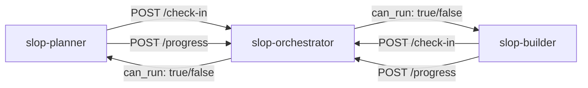
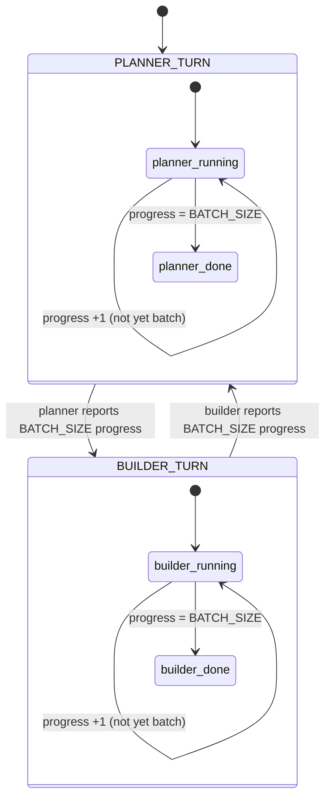

# Slop Orchestrator — Load Controller

## Overview

The slop-orchestrator is a lightweight coordination microservice that manages turn-based batch execution between slop-planner (idea generator) and slop-builder (project builder). Both services share a single LM Studio backend and must not run simultaneously — the orchestrator ensures only one is active at a time.

## Coordination Model



The orchestrator implements an alternating batch controller:

```
planner generates N ideas → orchestrator flips to builder → builder builds N projects → orchestrator flips back
```

`N` is `BATCH_SIZE` (env var, default 6).

## API Endpoints

| Method | Path | Auth | Description |
|--------|------|------|-------------|
| GET | /health | none | Health check — status, current turn, batch size, progress |
| GET | /state | none | Full state dump for debugging |
| POST | /check-in | none | Worker asks "may I run?" — body: `{ "role": "planner"\|"builder" }` |
| POST | /progress | none | Worker reports one completed iteration — body: `{ "role": "planner"\|"builder" }` |

### Response Shapes

#### GET /health
```json
{
  "status": "ok",
  "turn": "planner",
  "batchSize": 6,
  "plannerProgress": 3,
  "builderProgress": 0
}
```

#### GET /state
```json
{
  "turn": "planner",
  "plannerProgress": 3,
  "builderProgress": 0,
  "batchSize": 6
}
```

#### POST /check-in
```json
{
  "can_run": true,
  "turn": "planner",
  "progress": 3,
  "batchSize": 6
}
```

`can_run` is `true` only when the caller's role matches `turn`. Workers sleep 30s and retry when blocked.

#### POST /progress
```json
{
  "batch_complete": false,
  "turn": "planner",
  "progress": 4,
  "batchSize": 6
}
```

When `progress` reaches `BATCH_SIZE`, `batch_complete` becomes `true`, the turn flips, and progress resets to 0.

### Error Responses

| Status | Code | When |
|--------|------|------|
| 400 | INVALID_ROLE | Body missing `role` or role is not `planner`/`builder` |
| 409 | WRONG_TURN | Worker reporting progress when it's not their turn |

## State Machine



## Worker Integration

### Planner (slop-planner/scripts/agent-runner.js)

Before each iteration:
```javascript
await checkCanRun(); // Sleeps 30s and retries if blocked
```

After each completed iteration:
```javascript
await reportProgress(); // Logs when batch completes
```

### Builder (slop-builder/scripts/agent-runner.js)

Same pattern, `role: 'builder'`.

### Fail-Open Behavior

If the orchestrator is unreachable (network error, timeout), both `checkCanRun()` and `reportProgress()` log a warning and proceed anyway. This prevents the orchestrator from becoming a single point of failure — agents fall back to uncoordinated execution if coordination is unavailable.

### State Persistence

The orchestrator writes its state to `/tmp/orchestrator-state.json` on every state mutation (every `/progress` call). On startup, `restoreState()` reads this file so turn and progress survive orchestrator restarts. Writes use atomic tmp+rename to prevent corruption.

See [CONTAINER-INTERACTIONS.md](./CONTAINER-INTERACTIONS.md) for the self-healing architecture across all services.

## Configuration

| Variable | Default | Purpose |
|----------|---------|---------|
| `ORCHESTRATOR_PORT` | 3444 | HTTP listen port |
| `BATCH_SIZE` | 6 | Number of iterations before flipping turns |
| `LOG_LEVEL` | info | Pino log level |

All variables can be overridden via environment variables at runtime.

## Container

- **Base Image**: `node:22-slim`
- **PID 1**: tini
- **User**: non-root `node` (uid 1000)
- **Port**: 3444 (internal Docker network only — not exposed to host)
- **Network**: `slop-net` bridge
- **Health Check**: HTTP GET `/health` every 30s
- **Logging**: JSON-file, 10MB max, 3 files rotation

## Development

```bash
cd slop-orchestrator
npm install
npm test              # 17 tests — ~60ms
npm run test:watch    # TDD mode
npm run test:coverage # With v8 coverage
```

### Manual Verification

```bash
# Start locally
node scripts/orchestrator.js

# Health check
curl http://localhost:3444/health

# Planner check-in
curl -X POST http://localhost:3444/check-in -H 'Content-Type: application/json' -d '{"role":"planner"}'

# Report progress
curl -X POST http://localhost:3444/progress -H 'Content-Type: application/json' -d '{"role":"planner"}'
```
