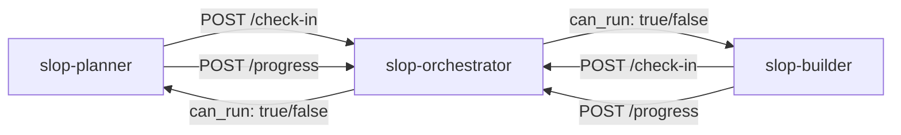
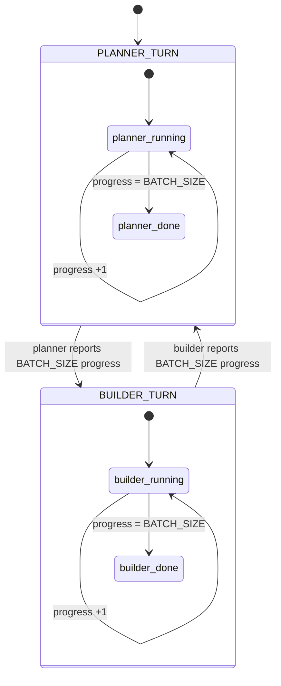
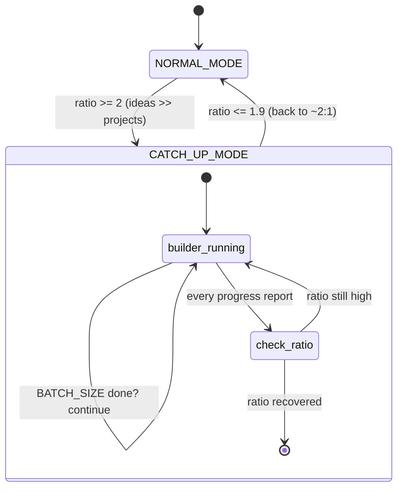
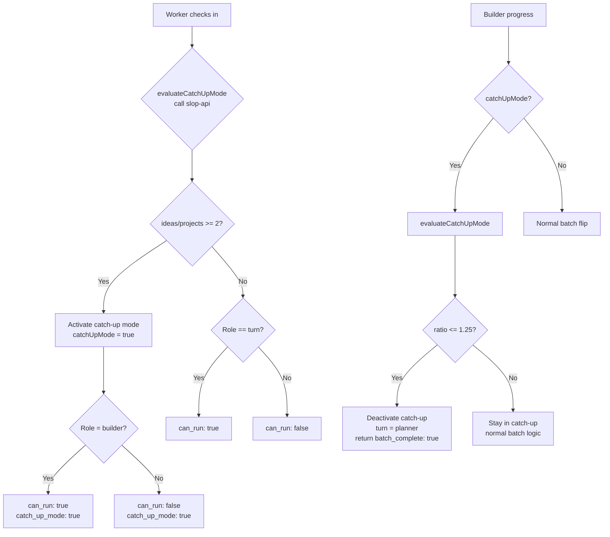

# Slop Orchestrator — Load Controller

## Overview

The slop-orchestrator is a lightweight coordination microservice that manages turn-based batch execution between slop-planner (idea generator) and slop-builder (project builder). Both services share a single LM Studio backend and must not run simultaneously — the orchestrator ensures only one is active at a time.

## Coordination Model



The orchestrator implements an alternating batch controller with catch-up mode:

```
Normal mode:     planner N → builder N → planner N → ...
Catch-up mode:  builder continues until ideas/projects ratio recovers
```

`N` is `BATCH_SIZE` (env var, default 6).

## API Endpoints

| Method | Path | Auth | Description |
|--------|------|------|-------------|
| GET | /health | none | Health check — status, current turn, batch size, progress, catch-up mode status |
| GET | /state | none | Full state dump for debugging |
| POST | /check-in | none | Worker asks "may I run?" — body: `{ "role": "planner"\|"builder" }` |
| POST | /progress | none | Worker reports one completed iteration — body: `{ "role": "planner"\|"builder" }` |
| POST | /git-sync-projects | none | Directly sync all new projects from slop-api to git (turn-independent) |

### Response Shapes

#### GET /health
```json
{
  "status": "ok",
  "turn": "planner",
  "batchSize": 6,
  "catchUpMode": true,
  "ideasCount": 71,
  "projectsCount": 7,
  "completionRatio": 10.14,
  "plannerProgress": 0,
  "builderProgress": 0
}
```

#### GET /state
```json
{
  "turn": "planner",
  "plannerProgress": 3,
  "builderProgress": 0,
  "batchSize": 6
}
```

#### POST /check-in
```json
{
  "can_run": true,
  "turn": "planner",
  "progress": 3,
  "batchSize": 6
}
```

`can_run` is `true` only when the caller's role matches `turn` (or when catch-up mode is active and the caller is `builder`). Workers sleep 30s and retry when blocked.

### Catch-Up Mode Response

During catch-up mode, the check-in response includes the ratio:

```json
{
  "can_run": false,
  "turn": "planner",
  "progress": 0,
  "batchSize": 6,
  "catch_up_mode": true,
  "ideas_count": 71,
  "projects_count": 7,
  "completion_ratio": 10.14
}
```

Planner always gets `can_run: false` in catch-up mode. Builder always gets `can_run: true`.

#### POST /progress
```json
{
  "batch_complete": false,
  "turn": "planner",
  "progress": 4,
  "batchSize": 6
}
```

When `progress` reaches `BATCH_SIZE`, `batch_complete` becomes `true`, the turn flips, and progress resets to 0.

During catch-up mode, the progress response includes the catch-up flag:

```json
{
  "batch_complete": false,
  "turn": "builder",
  "progress": 4,
  "batchSize": 6,
  "catch_up_mode": true
}
```

When catch-up mode deactivates (ratio recovered), the progress handler returns `batch_complete: true` with `catch_up_mode: false`.

### Error Responses

| Status | Code | When |
|--------|------|------|
| 400 | INVALID_ROLE | Body missing `role` or role is not `planner`/`builder` |
| 409 | WRONG_TURN | Worker reporting progress when it's not their turn |

## State Machine

### Normal Mode (balance within threshold)



### Catch-Up Mode (ideas/projects ≥ threshold)



## Catch-Up Mode — Auto-Balancing

When the ideas-to-projects ratio exceeds 2:1 (e.g., 12 ideas for 6 projects), the orchestrator enters **catch-up mode**, forcing the builder to run exclusively until the ratio recovers back to ~2:1.

### Triggers

| Event | Condition | Action |
|-------|-----------|--------|
| **Enter catch-up** | `ideas / projects >= CATCH_UP_RATIO_THRESHOLD` (default 2) | Builder runs exclusively, planner blocked |
| **Exit catch-up** | `ideas / projects <= CATCH_UP_TARGET_RATIO` (default 1.9) | Normal turn-based operation resumes |

### Behavior

- **Every check-in** re-evaluates the ratio (most responsive)
- **Every builder progress report** re-evaluates the ratio (catches recovery ASAP)
- At batch boundaries (`BATCH_SIZE`), git sync still fires for new projects
- When ratio recovers, the turn resets to `planner` so the planner can start generating again
- Catch-up mode state (`catchUpMode`, `ideasCount`, `projectsCount`) is persisted across restarts

### Ratio Calculation

Only projects with `status === "Complete"` count toward the projects side of the ratio.
Projects with status like `"Complete (tests failed)"` are excluded — they failed their tests
and aren't genuinely functional. This prevents the ratio from being artificially improved
by broken builds.

### Flow



#### POST /git-sync-projects

```json
{ "synced": 3 }
```

Turn-independent git sync endpoint used by the builder's reconciliation flow. Calls `syncAllProjects()` directly without interacting with the turn-based state machine.

## Worker Integration

### Planner (slop-planner/scripts/agent-runner.js)

Before each iteration:
```javascript
await checkCanRun(); // Sleeps 30s and retries if blocked
```

After each completed iteration:
```javascript
await reportProgress(); // Logs when batch completes
```

### Builder (slop-builder/scripts/agent-runner.js)

Same pattern, `role: 'builder'`.

### Retry & Resilience

`checkCanRun()` polls the orchestrator with retry + backoff:
- When the orchestrator says `can_run: false`, sleeps 30s and retries
- When the orchestrator is unreachable (network error, timeout), retries with
  exponential backoff starting at 5s, capping at 30s
- After `MAX_ORCHESTRATOR_RETRIES` (10) consecutive failures, throws an error
  to prevent the agent from running without coordination
- This prevents both containers from firing the LLM simultaneously

`reportProgress()` logs a warning on failure but does NOT fail the parent
iteration — progress reporting is advisory; the next `/check-in` will
re-sync state.

### Recovery & Reconciliation

Both planner and builder invoke `checkCanRun()` before every `runCline()`
call during crash recovery to ensure they don't bypass the orchestrator:
- `recoverPlannerState()` calls `await checkCanRun()` before each re-run phase
- `reconcileProjectsDir()` (builder) calls `await checkCanRun()` before each
  build phase in the recovery loop

### State Persistence

The orchestrator writes its state to `/tmp/orchestrator-state.json` on every state mutation (every `/progress` call). On startup, `restoreState()` reads this file so turn and progress survive orchestrator restarts. Writes use atomic tmp+rename to prevent corruption.

See [CONTAINER-INTERACTIONS.md](./CONTAINER-INTERACTIONS.md) for the self-healing architecture across all services.

## Git Push

The orchestrator owns all git operations via `scripts/git-push.js`. At batch boundaries (when `/progress` returns `batch_complete: true`), the orchestrator syncs all content from slop-api to a single `main` branch on GitHub.

### Sync Flow

1. **`ensureGitRepo()`** — initializes `/git-repo`, configures user/email, sets remote with GITHUB_TOKEN injection
2. **`syncApps()`** — downloads all ideas from `GET /api/v1/ideas` and `GET /api/v1/ideas/:slug/raw`, writes to `apps/{slug}.md`
3. **`syncProject()`** — downloads project tar.gz from `GET /api/v1/projects/:slug/download`, extracts to `projects/{slug}/`
4. **`commitAndPush()`** — stages `apps/` and `projects/`, commits with timestamped message, force-pushes to `main`

### Environment Variables

| Variable | Default | Purpose |
|----------|---------|---------|
| `GIT_REPO_URL` | — | Remote URL (token injected from GITHUB_TOKEN) |
| `GITHUB_TOKEN` | — | GitHub PAT |
| `GIT_USER_NAME` | `Slop Generator` | Commit author |
| `GIT_USER_EMAIL` | `slop-generator@localhost` | Commit author email |

See [GIT_OPS.md](./GIT_OPS.md) for the full git strategy and working directory structure.

---

## File Structure (Module-Per-Responsibility)

The orchestrator's `scripts/` directory is split into single-concern modules:

```
slop-orchestrator/scripts/
├── orchestrator.js       # Express server, routes, state machine, main()
├── state-store.js        # loadState() + saveState() + restoreState()
└── git-push.js           # ensureGitRepo() + syncApps() + syncProject() + commitAndPush()
```

---

## Configuration

| Variable | Default | Purpose |
|----------|---------|---------|
| `ORCHESTRATOR_PORT` | 3444 | HTTP listen port |
| `BATCH_SIZE` | 6 | Number of iterations before flipping turns |
| `CATCH_UP_RATIO_THRESHOLD` | 10 | Ideas/projects ratio that triggers catch-up mode |
| `CATCH_UP_TARGET_RATIO` | 1.25 | Ratio at which normal operation resumes (inverse of 80%) |
| `LOG_LEVEL` | info | Pino log level |

All variables can be overridden via environment variables at runtime.

### Ratio Formula

Both ratios use the same formula:

```
ideasToProjects = totalIdeas / totalProjects
```

- **Threshold (10)**: At 71 ideas / 7 projects = 10.14, catch-up activates
- **Target (1.25)**: When projects catch up such that 50 ideas / 40 projects = 1.25, catch-up deactivates (80% completion rate)

## Container

- **Base Image**: `node:22-slim`
- **PID 1**: tini
- **User**: non-root `node` (uid 1000)
- **Port**: 3444 (internal Docker network only — not exposed to host)
- **Network**: `slop-net` bridge
- **Health Check**: HTTP GET `/health` every 30s
- **Logging**: JSON-file, 10MB max, 3 files rotation

## Development

```bash
cd slop-orchestrator
npm install
npm test              # 17 tests — ~60ms
npm run test:watch    # TDD mode
npm run test:coverage # With v8 coverage
```

### Manual Verification

```bash
# Start locally
node scripts/orchestrator.js

# Health check
curl http://localhost:3444/health

# Planner check-in
curl -X POST http://localhost:3444/check-in -H 'Content-Type: application/json' -d '{"role":"planner"}'

# Report progress
curl -X POST http://localhost:3444/progress -H 'Content-Type: application/json' -d '{"role":"planner"}'
```
