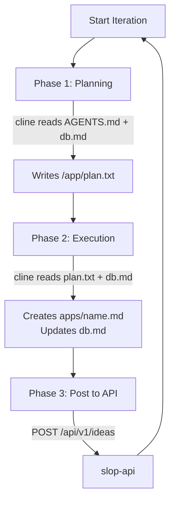
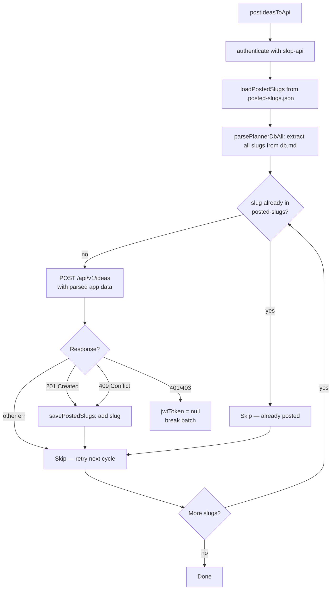

# Slop Planner — App Idea Generator

## Overview

The Slop Planner is an autonomous agent that generates unique app ideas using Cline CLI with LM Studio as the AI backend. It runs as a loop, each iteration producing one new app idea. Generated ideas are pushed to slop-api for centralized storage and consumption by slop-builder.

## Agent Loop (scripts/agent-runner.js)



Each iteration has three phases:

**Phase 1: Planning**
- Calls `cline -P lmstudio` with the planning prompt
- cline reads AGENTS.md (its role instructions) and db.md (existing ideas)
- cline formulates a plan and writes it to /app/plan.txt
- Plan format: App Name, Category, Problem, Uniqueness, Features, Target Audience

**Phase 2: Execution**
- Calls `cline -P lmstudio` with the execution prompt
- cline reads /app/plan.txt and db.md
- cline creates the app idea file in apps/{name}.md
- cline updates db.md with the new entry

**Phase 3: Post to API**
- `agent-runner.js` calls `postIdeasToApi()` to push ideas to slop-api
- Git operations are handled by the orchestrator at batch boundaries

## API Integration

The planner authenticates with slop-api using a shared `API_KEY`:
1. POST /api/v1/auth/token with the API_KEY to get a JWT
2. POST /api/v1/ideas with the JWT to push each new idea

### postIdeasToApi() — Deterministic Bulk Push

`postIdeasToApi()` runs every iteration (after idea generation and on startup recovery). It walks all entries in `db.md` and POSTs any new slugs to slop-api:



**Key design decisions:**
- **Idempotent**: 409 Conflict is treated as success — the slug is already there, mark it posted
- **Persistent tracking**: `.posted-slugs.json` survives restarts (bind-mounted volume), so re-posting is always safe
- **Error resilience**: Network errors skip individual slugs and retry on next cycle; auth errors clear the JWT and break the batch
- **Parsed format**: `parsePlannerAppFile()` converts planner's markdown into the API's structured JSON shape (name, slug, overview, problemSolved, targetAudience, keyFeatures, monetization, techStack, implementationPlan)

## File Structure (Module-Per-Responsibility)

The planner's `scripts/` directory is split into single-concern modules. The main `agent-runner.js` is a thin orchestrator — it imports all modules, runs the `main()` loop, and re-exports symbols for test compatibility.

```
slop-planner/scripts/
├── agent-runner.js        # Thin orchestrator: main() loop + re-exports (~110 lines)
├── agent.js               # configureProvider() + runCline() (spawnSync)
├── prompt-builder.js      # buildPlanPrompt() + buildAgentPrompt()
├── database.js            # parsePlannerDb() + parsePlannerAppFile() + postedSlugs tracking
├── api-client.js          # authenticate() + postIdeasToApi()
├── orchestrator-client.js # checkCanRun() + reportProgress()
└── recovery.js            # recoverPlannerState()
```

All symbols are re-exported from `agent-runner.js` so existing test imports work unchanged.

- **config/settings.json**: max_iterations (default 50), timeout_ms (default 300000)
- **config/.env**: CLINE_API_BASE_URL, CLINE_MODEL, API_KEY
- Environment variables override settings.json values

### API Connection Variables

| Variable | Default | Purpose |
|---|---|---|
| `API_KEY` | — | Pre-shared key for JWT auth with slop-api |
| `CLINE_API_BASE_URL` | `http://192.168.0.13:1234/v1` | LM Studio endpoint |
| `CLINE_MODEL` | `qwen/qwen3.5-9b` | Model identifier for LM Studio |

> **Note**: Git operations are handled entirely by slop-orchestrator. The planner no longer syncs to git.

## Generated Ideas

Each idea is a markdown file in apps/ following the template in slop-planner/AGENTS.md. The db.md file tracks all ideas with categories, status, and dates.

## Container

- **Base Image**: node:22-slim → multi-stage build
- **Runtime Dependencies**: tini, git, ca-certificates, cline@3.0.29
- **User**: node (uid 1000, non-root)
- **Health Check**: node -e "console.log('healthy')"
- **Entrypoint**: tini → node scripts/agent-runner.js
- **Ports**: None — planner is a worker, not a server
- **Network**: Internal Docker bridge (slop-net), calls slop-api over HTTPS

## Running

From the repo root (where `docker-compose.yml` lives):

```bash
docker compose up -d --build    # Build and start all services
docker compose ps               # Check status
docker logs slop-planner -f     # Watch planner progress
```
