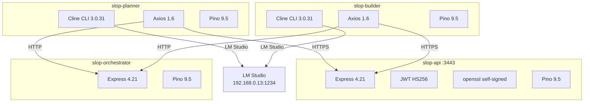

# Tech Stack

> See [README.md](../README.md) for the full project overview and quick start guide.

## Service Dependency Graph



## Four Services, Four Stacks

| Component | slop-planner | slop-api | slop-builder | slop-orchestrator |
|-----------|-------------|----------|--------------|-------------------|
| Runtime | Node.js 22 | Node.js 22 | Node.js 22 | Node.js 22 |
| Base Image | node:22-slim | node:22-slim | node:22-slim | node:22-slim |
| Init | tini | tini | tini | tini |
| AI Orchestration | Cline CLI 3.0.31 | — | Cline CLI 3.0.31 | — |
| Web Framework | — | Express 4.21 | — | Express 4.21 |
| Auth | — | JWT (HS256) | — | — |
| TLS | — | openssl self-signed | — | — |
| HTTP Client | axios 1.6.0 | — | axios 1.6.0 | axios 1.6.0 |
| Config | dotenv 16.3.0 | dotenv | dotenv 16.3.0 | dotenv 16.3.0 |
| Logging | pino 9.5 | pino 9.5 | pino 9.5 | pino 9.5 |
| Git | git CLI | — | git CLI | — |
| TLS | — | openssl self-signed | — |
| HTTP Client | axios 1.6.0 | — | axios 1.6.0 |
| Config | dotenv 16.3.0 | dotenv | dotenv 16.3.0 |
| Logging | pino 9.5 | pino 9.5 | pino 9.5 |
| Git | git CLI | — | git CLI |

## Common Infrastructure

- **AI Backend**: LM Studio at http://192.168.0.13:1234/v1
- **Model**: qwen/qwen3.5-9b (configurable via CLINE_MODEL)
- **Protocol**: OpenAI-compatible chat completions endpoint
- **Network**: Docker bridge network (slop-net)

## slop-api Stack

- **Server**: Express 4.21 on Node.js 22
- **Auth**: Pre-shared API_KEY → JWT (jsonwebtoken 9.0.2, HS256)
- **TLS**: Self-signed certs via openssl at startup (CN=localhost)
- **Port**: 3443 (HTTPS)
- **Data Store**: File-based — `data/db.md` + `data/apps/*.md`
- **Endpoints**: Health, auth/token, ideas CRUD
- **Container**: Single-stage build, non-root user (uid 1000), HEALTHCHECK via /health

## slop-planner & slop-builder Shared Stack

Both use Cline CLI for AI-driven agent workflows:

- **CLI**: cline@3.0.31 (npm global install, bundled with Bun)
- **Config**: `~/.cline/data/settings/providers.json` written by agent-runner.js
- **Invocation**: `spawnSync('cline', ['-P', 'lmstudio', prompt])` — avoids shell quoting
- **Container**: Multi-stage build (builder + runtime), non-root user (uid 1000)

## slop-orchestrator Stack

- **Server**: Express 4.21 on Node.js 22
- **State**: In-memory with JSON file persistence (`/tmp/orchestrator-state.json`) — survives restarts
- **Port**: 3444 (HTTP, internal Docker network — not exposed to host)
- **Endpoints**: /health, /state, /check-in, /progress
- **Resilience**: Workers retry with exponential backoff if unreachable — up to 10 retries before error
- **Container**: Single-stage build, non-root user (uid 1000), HEALTHCHECK via /health

## Package Dependency Summary

```
slop-planner/package.json:       axios, dotenv, pino           (lightweight)
slop-api/package.json:           express, jsonwebtoken, pino   (auth + server + logging)
slop-builder/package.json:       axios, dotenv, pino           (lightweight)
slop-orchestrator/package.json:  express, axios, dotenv, pino   (server + http client + logging)
```

## Testing Stack

| Tool | Version | Purpose |
|------|---------|---------|
| Vitest | ^3.1.1 | Test runner, assertions, mocking, coverage |
| Supertest | ^7.0.0 | HTTP integration testing (slop-api only) |
| v8 (coverage) | built-in | Code coverage provider |

Tests live at `tests/{service-name}/` at the repo root. Each service has a `vitest.config.js` pointing at its test directory.
