# Testing Guide

> Last updated: 2026-07-01

## Test Architecture

```mermaid
graph TB
    subgraph slop-api[slop-api Tests — 42 tests]
        PA[parsers.test.js<br/>22 tests]
        PD[parseDatabase.test.js<br/>2 tests]
        RT[routes.test.js<br/>18 tests<br/>supertest]
    end

    subgraph slop-planner[slop-planner Tests — 29 tests]
        PP[planner-prompt.test.js<br/>8 tests]
        PR[planner-runner.test.js<br/>7 tests]
        PRE[planner-recovery.test.js<br/>14 tests]
    end

    subgraph slop-builder[slop-builder Tests — 57 tests]
        BD[builder-database.test.js<br/>9 tests]
        BT[builder-tests.test.js<br/>7 tests]
        BP[builder-prompt.test.js<br/>28 tests]
        BRE[builder-recovery.test.js<br/>13 tests]
    end

    subgraph slop-orchestrator[slop-orchestrator Tests — 17 tests]
        OT[orchestrator.test.js<br/>17 tests<br/>built-in http]
    end

    PA -->|mock fs| FS[Node fs]
    BD -->|mock fs| FS
    RT -->|supertest| EX[Express App]
    OT -->|http.request| EX2[Express App<br/>in-memory state]
    PP -->|verify output| TX[Generated Prompt Text]
    PR -->|mock spawn| SP[child_process]
    BT -->|mock spawn| SP
```



Comprehensive overview of the test structure, tools, and conventions for the Slop Generator monorepo.

## Quick Start

```bash
# Install test dependencies (already done at setup)
cd slop-api && npm install
cd slop-planner && npm install
cd slop-builder && npm install

# Run all tests
cd slop-api && npm test
cd slop-planner && npm test
cd slop-builder && npm test

# Run with coverage
cd slop-api && npx vitest run --coverage
```

## Directory Structure

```
tests/
├── slop-api/
│   ├── fixtures/
│   │   ├── sample-db.md          # 3-idea database fixture
│   │   ├── sample-idea.md        # Full EcoTrack markdown
│   │   └── sample-idea.json      # Expected parsed output
│   ├── parsers.test.js           # 22 tests — markdown section parsers
│   ├── parseDatabase.test.js     # 2 tests — file-level database parsing
│   └── routes.test.js            # 18 tests — API route integration (supertest)
│
├── slop-planner/
│   ├── fixtures/
│   │   └── sample-plan.txt       # Sample planning output
│   ├── planner-prompt.test.js    # 8 tests — buildPlanPrompt/buildAgentPrompt
│   ├── planner-runner.test.js    # 7 tests — configureProvider/runCline (mocked)

│   └── planner-recovery.test.js  # 14 tests — loadState, saveState, recoverPlannerState
│
└── slop-builder/
    ├── fixtures/
    │   ├── sample-db.md          # Builder db with Complete/Tests Failed entries
    │   ├── sample-idea.json      # API response for SkillSwap Connect
    │   └── sample-plan.md        # Full 7-phase plan with test command
    ├── builder-database.test.js  # 9 tests — isAlreadyBuilt/updateDatabase
    ├── builder-tests.test.js     # 7 tests — runTests retry logic
    ├── builder-prompt.test.js    # 28 tests — buildDeepPlanPrompt/buildExecutePrompt/buildSimpleTaskPrompt
    └── builder-recovery.test.js  # 13 tests — loadState, saveState, reconcileProjectsDir, recoverBuilderState

└── slop-orchestrator/
    └── orchestrator.test.js      # 17 tests — state machine, turn flips, error cases, state persistence
```

**Total: 145 tests across 11 files**

## Test Categories

### Parser Unit Tests (`tests/slop-api/parsers.test.js`)
Pure functions that parse markdown sections. No filesystem or network dependencies.
- `parseBulletList()` — dash, asterisk, indented, no-bullets, empty, blank lines
- `parseKeyFeatures()` — title+desc, title-only, no-pattern, mixed, colons
- `parseStrategyList()` — dash, numbered, raw text
- `parseTechStack()` — bold-key, key normalization, raw text
- `parseProgressChecklist()` — mixed, all-checked, all-unchecked, punctuation, raw text

### API Route Integration Tests (`tests/slop-api/routes.test.js`)
End-to-end HTTP tests via supertest against the Express app.
- `GET /health` — health check returns 200
- `POST /api/v1/auth/token` — valid key, missing key, empty body, wrong key
- Auth middleware — missing header, malformed token, expired token, valid token
- `GET /api/v1/ideas` — count + required fields
- `GET /api/v1/ideas/random` — 404 or 200
- `GET /api/v1/ideas/:slug` — nonexistent slug returns 404
- `POST /api/v1/ideas` — create, missing slug, missing name, slug sanitization, 409 conflict

### Database Tests (`tests/slop-builder/builder-database.test.js`)
Tests for `isAlreadyBuilt()` and `updateDatabase()` with mocked filesystem.
- `isAlreadyBuilt` — no db, Complete status, Tests Failed status, slug not found, exact slug match
- `updateDatabase` — new db creation, status update, append entry, no duplicates

### Test Runner Tests (`tests/slop-builder/builder-tests.test.js`)
Tests for `runTests()` retry logic with mocked child_process.
- Missing plan.md, test command extraction, first-pass success, retry success, exhausted retries, fallback command detection, no command found

### Prompt Builder Tests
Tests that generated prompts contain required instructions.
- Planner: AGENTS.md, db.md, plan.txt, format template, no-file-creation rule
- Builder: slug injection, JSON embedding, AGENTS.md, .clinerules, plan.md, phase checkboxes, STOP rule

### Agent Runner Tests (`tests/slop-planner/planner-runner.test.js`)
Tests for `configureProvider()` and `runCline()` with mocked spawn/fs.
- Directory creation, config writing, cline invocation, success output, error propagation, timeout

## Mocking Strategy

| Dependency | Mock Approach |
|------------|--------------|
| `fs` (readFileSync, existsSync, writeFileSync) | `vi.mock('fs', ...)` returns controlled data |
| `child_process.spawnSync` | `vi.mock('child_process', ...)` returns { status, stdout, stderr } |
| `axios` (HTTP client) | `vi.mock('axios', ...)` returns `{ post, get }` with mockResolvedValue |
| `process.exit` | Direct assignment `process.exit = vi.fn()` in beforeEach |

## Adding New Tests

1. Create the test file in `tests/{service-name}/` following the naming convention
2. Add fixtures to `tests/{service-name}/fixtures/` if needed
3. Import functions from the service's source using relative paths `../../{service}/scripts/file.js`
4. Ensure the source module exports needed functions and doesn't auto-execute at import time
5. Run `npm test` in the service directory to verify

## CI Pipeline

Tests are enforced on every push. See `.github/instructions/test.instructions.md` for the mandatory testing rules.
